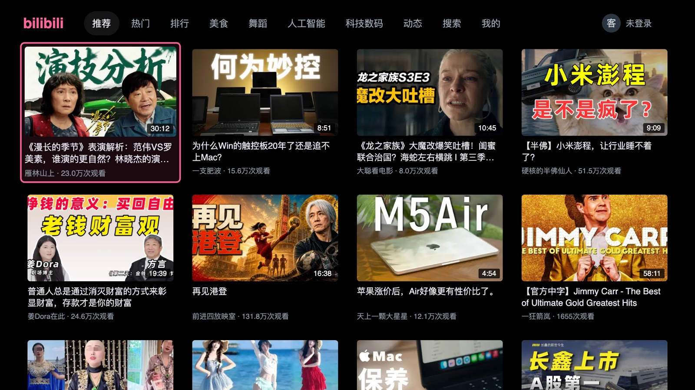
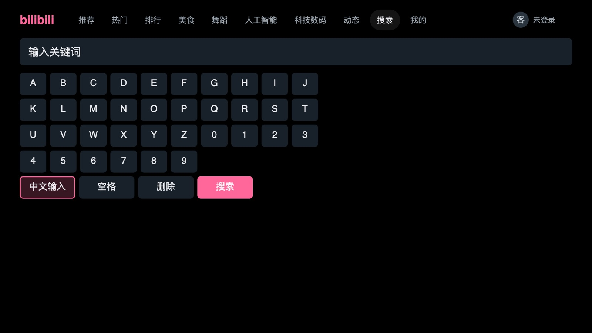

# bilibili on Samsung TV

**[中文](README.md) · English**

A bilibili client for Samsung Tizen televisions, driven entirely by the remote.
Plain ES5, no build step, **no backend, no proxy, no server** — the TV talks to
bilibili directly.

Several people can be signed in at once, each with their own watch history.

> LG webOS has a good one, [bili-webos](https://github.com/asdf17128/bili-webos).
> The Samsung side was empty. This fills that gap.
>
> **Not affiliated with bilibili or Samsung.** Personal project.

|  |  |
|---|---|
|  |  |
| The home feed. Focus is geometric — a ragged grid needs nobody to declare a column count | 1080p H.265, with the scrub bar, quality badge and key hints |
|  |  |
| Press down while playing for description and related videos — **the video keeps running** | Search, with the TV's own Chinese IME one button away |

## What works

Recommendations, popular, rankings, four category tabs, the dynamic feed, search
using the television's own IME, QR sign-in for any number of accounts,
multi-part uploads, resume across parts and across devices (pick up where the
phone left off), autoplay next, scrubbing with thumbnail previews and chapter
ticks.

Playback takes two routes: progressive through AVPlay, DASH through
[Shaka Player](https://github.com/shaka-project/shaka-player).

About **2.5–3.5 seconds** from pressing OK to a picture, 1080p H.265.

## Install

Samsung's store does not accept third-party clients for other people's services
— it pulled the unofficial Twitch app in 2019 for exactly that — so this is
sideloaded. You need a computer on the same network, **once**.

```bash
git clone <this repo> && cd bilibili-tizen
zsh tools/setup.sh      # asks a few questions, issues the certificate. Once.
zsh tools/deploy.sh     # check, sign, install, launch
```

`setup.sh` walks you through enabling Developer Mode, finds your TV, reads its
DUID and issues the certificate. Requirements: Node, Python 3, and the
[Tizen Studio](https://developer.tizen.org/development/tizen-studio/download)
CLI (**the IDE is not needed**).

> ### The certificate is where everyone gets stuck
>
> Tizen's own distribution certificates fail with `Invalid certificate chain` on
> every 2023+ set — **both** the pair that expired in 2022 and the `-new` pair
> valid to 2032. Same error for both, so it is a trust-chain problem, not an
> expiry one. You need a Samsung-issued one.
>
> `setup.sh` handles it. If you only want the certificate and have nothing to do
> with this project, it is a standalone tool:
>
> **[samsung-tv-cert](https://github.com/titlog/samsung-tv-cert)**
> [](https://www.npmjs.com/package/samsung-tv-cert)
> — `npx samsung-tv-cert --duid <YOUR-DUID>`
>
> No Eclipse, no sudo, no Certificate Manager GUI. **Useful for anything you
> sideload onto a Samsung TV** — Jellyfin, community Twitch, your own app.

## Two login routes — a trade-off you should decide for yourself

This project **defaults to the TV login**, because multiple accounts are not
optional on a television: the set in the living room is shared, and one merged
watch history serves nobody. That route has a cost, and the cost is yours to
weigh, so both routes are implemented and both work.

| | **TV login** (default) | **Web QR** |
|---|---|---|
| Endpoint | `passport-tv-login` | `passport-login/web` |
| Requires appkey signing | **Yes** — bilibili's official TV client appkey | No |
| Presents to bilibili as | the official television client | a web browser |
| Credentials returned | SESSDATA / bili_jct / access_token / refresh_token, **as readable JSON** | **unreadable** |
| Multiple accounts | ✅ any number, switchable | ❌ one only |
| Watch history reported back | ✅ | ❌ |
| Survives a power cycle | ✅ | ⚠️ depends on the engine's global cookie jar |

**Why the web QR flow cannot do multiple accounts — this is structural, not
unimplemented.** Its polling response carries no credentials, only a cross-origin
redirect; the session is that hop's `Set-Cookie`, swallowed into the engine's own
**global** jar where XHR can never see it. An account signed in that way cannot
be stored, cannot be restored, and cannot coexist with another — the jar holds
one, and there is no way to put a previous one back.

**The appkey values are not secret** — they are documented across the bilibili
API community, and publishing them leaks nothing. But *using* them is a
decision: your client presents itself to bilibili as the official TV client.
That is a terms-of-service judgement, not a technical one.

**To drop the TV login:** delete the two constants at the top of
`app/js/auth.js` and have `login()` call `startWeb` directly. Everything keeps
working for one account. The costs: a second sign-in dispossesses the first
(`Accounts.needsRelogin` flags whoever lost the jar), and watch progress stops
being reported back to bilibili — `/x/v2/history/report` accepts `access_key`
and rejects `csrf` from this device, and only the TV route yields an
`access_key`.

The web route is **already the automatic fallback** when the TV route is
unavailable, and it falls back *before any QR code reaches the screen* —
swapping the code out while somebody is holding up a phone is worse than
failing.

## What this repository is really for

The client works, but the expensive part was finding out what the platform does.
[`CLAUDE.md`](CLAUDE.md) records every measurement, **including the ones that
overturned earlier conclusions**. A few that cost a day each:

- **bilibili needs no `Referer`.** It rejects one it does not recognise but
  accepts requests with none, and 403s `curl/*` user agents. So probing with
  bare `curl` makes every response read like "Referer required" — a false signal
  that nearly justified building a LAN proxy this project does not need.
- **AVPlay exposes only `COOKIE` and `USER_AGENT`** as streaming properties. Any
  design needing a third request header has to change shape.
- **Setting `COOKIE` to an empty string breaks playback outright** — AVPlay
  emits a malformed header and the CDN refuses everything. It looks exactly like
  a broken stream, and **only appears once a viewer signs in**.
- **This firmware's widget cannot send a `Cookie` header at all** — Chromium 120
  silently drops `setRequestHeader` for the forbidden name, and the engine's
  global cookie jar cannot be filled either (cross-origin lockdown). So the
  signed-in session travels as `access_key` in the query, which nothing can
  strip. This overturned a claim that stood in the docs for seven days — that the
  firmware *does* let a widget set the header. That measurement was taken with a
  single account, where the header and the jar necessarily point at the same
  person and so cannot be told apart; it only broke when a second account arrived.
- **AVPlay plays DASH, but only from a manifest delivered over HTTP.** `data:`
  and `file://` are both refused, and a widget cannot listen on a socket — which
  is why DASH goes through MSE.
- **The single-file (`durl`) form caps at 720p** and is refused outright for
  videos with a high-tier source: the API still returns a url and the CDN answers
  403 on every mirror and every quality.
- **Rotating CDN hostnames does not work here.** Signatures are host-bound; seven
  of eight alternates 403, and the one that answers runs thirty times slower.
- **Same video, plays on the phone but not the TV — the cause is playurl's
  `platform`.** The web endpoint (`platform=pc`, what the client always used)
  mints a stream token the CDN's strict nodes 403; the app endpoint
  (`app.bilibili.com/x/playurl`, `platform=android`) mints one they accept — and
  the phone app is an app-endpoint client. `platform` decides token strength,
  `access_key` decides which tiers are visible (without it you get only the
  signed-out low tiers); you need both. On a 403 the client switches to the app
  endpoint for a strong token and reads each file's header itself to supply the
  `SegmentBase` the app endpoint omits. Full investigation (including twice
  mistaking "the weather" for a diagnosis) in
  [`docs/播放流令牌-app端点根治.md`](docs/播放流令牌-app端点根治.md).
- **Every AVPlay callback needs a generation guard.** `setListener` registers on
  a singleton and `close()` does not detach it, so a torn-down session's
  `onerror` lands in whatever is playing now. This **inverted a conclusion** once.
- **This widget can update itself** — `new Function`, `blob:` scripts, remote
  `script` tags and `wgt-private` read/write all verified on the device.

The document also records the debugging discipline that got there: **a plausible
mechanism is not a diagnosis**. Again and again, a failure was explained by the
first self-consistent story, designed around, and shipped — before measurement
said otherwise. The two facts above are each one such case ("the firmware allows
the header", "the video's blanket 403 is weather"), and the night that pinned
down `platform` mistook "the weather" for the cause twice over. Every time, the
previous explanation still held, and still was not the cause. **For a
cross-device difference, get the evidence from the device in question itself; two
observations at different times cannot be subtracted into a diagnosis.**

## Layout

```
app/          the client (ES5, IIFE modules, no build step)
  vendor/     Shaka Player, prebuilt
spike/        the harness that established the platform facts
tools/
  setup.sh            once: your TV, your certificate
  deploy.sh           check, sign, install, launch
  samsung-cert.mjs    headless Samsung certificate issuance
  devserver.mjs       run the client in a desktop browser (screenshots, UI work
                      without a deploy cycle)
  collect.mjs         diagnostics collector on :8099
  lint.mjs            catches calls to things that do not exist
  *-verify.mjs        manifest / accounts / md5 / QR — each one gates the deploy
CLAUDE.md     findings, traps, and how to debug on a retail set
```

## Debugging

Retail sets close everything convenient: `dlog` returns nothing, the Web
Inspector never opens its port, `sdb shell` is `closed`. So the app reports to
itself — `tools/collect.mjs` listens on :8099 and `deploy.sh` wires the address
into the build.

**Start the collector before deploying.** The app gives up reporting after five
consecutive failures and does not retry until it is restarted — the wrong order
means waiting for nothing.

```bash
zsh tools/deploy.sh --selftest
```

walks the whole flow on the device unattended — grid, playback, panel,
scrolling, scrubbing, long seeks across the buffer, pause, resume, exit,
accounts — reporting each step. **It is the only way to check a build without
sitting in front of the television.**

## Licence

MIT. bilibili is a trademark of its owner; this project is unaffiliated.
